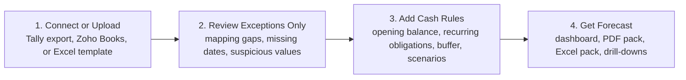
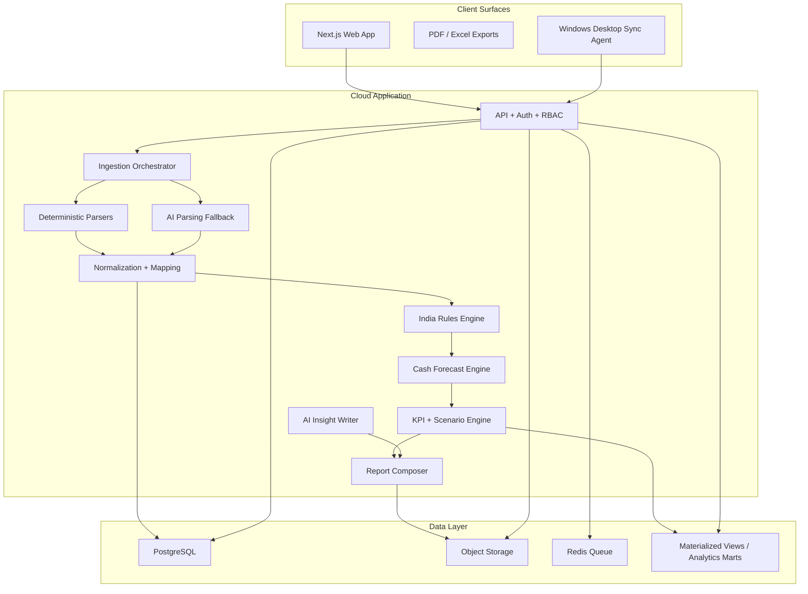

according to this plan  have everything is perfectly build ? check , # India Cashflow OS: Architecture Plan for an SME-First, CA-Friendly Forecasting Platform

## Summary
We will **not** start by building a full Fathom clone. We will start with a **cash wedge**: a seamless, 13-week cash forecasting and risk cockpit for Indian manufacturing and trading SMEs, with CAs as onboarding/trust partners and a path to full FP&A later.

The problem we are solving first is: **Indian SMEs know revenue and profit on paper, but do not know with confidence when cash will go short, which receivables are unreliable, and which GST/TDS/EPF/MSME obligations will cause pain.** This is worsened by messy Tally/Excel data, delayed collections, inventory-heavy operations, and India-specific compliance timing.

The architecture must guarantee **deterministic accounting math and auditability**. We can target **100% arithmetic correctness** in the engine; we cannot honestly promise **100% real-world forecast truth** because forecast quality depends on input quality, payment behavior, and user assumptions. The product must make this explicit by showing confidence, exceptions, and traceability for every number.

Reference patterns informing this design:
- [Fathom](https://www.fathomhq.com/features/cash-flow-forecasting), [sample reports](https://www.fathomhq.com/reports), and [scenario support](https://support.fathomhq.com/en/articles/4613320-faq-can-i-create-multiple-forecasts-in-fathom-forecasting): scenario-rich forecasting, professional report packs, strong visual storytelling.
- [Workday Adaptive Planning](https://www.workday.com/en-us/products/adaptive-planning/technology.html), [OfficeConnect](https://www.workday.com/en-us/products/adaptive-planning/officeconnect.html), and [analytics/reporting](https://www.workday.com/en-au/products/adaptive-planning/financial-planning/analytics-reporting.html): a governed calculation engine, scenario modeling, one-click refreshed reports, transaction drill-down.
- [Anaplan Hyperblock](https://www.anaplan.com/jp/platform/planning-and-modeling/): central multidimensional calculation engine separated from ingestion and presentation.
- [BILL Insights & Forecasting](https://www.bill.com/blog/bill-insights-forecasting) and [for firms](https://www.bill.com/accountant-resource-center/articles/uplevel-your-cas-practice-with-bill-insights-forecasting): AP/AR + forecasting in one workflow, accountant-inclusive distribution.
- [Upflow analytics](https://upflow.io/en/features/analytics/): AR visibility, DSO, customer scoring, and collections-based forecasting.
- [Tally integration/export](https://help.tallysolutions.com/integration-initiated-from-tally/), [Zoho Books API](https://www.zoho.com/books/api/v3/), [MSME dashboard](https://dashboard.msme.gov.in/), [CBDT Circular 1/2024](https://incometaxindia.gov.in/communications/circular/circular-1-2024.pdf), [GST portal guidance](https://tutorial.gst.gov.in/userguide/returns/GSTR3B.htm): hybrid ingestion and India-specific rules.

## Product Shape
The first user journey must be four steps only.

The first release must produce these user-facing outcomes:
- A **13-week cash balance forecast** computed internally at daily granularity and displayed weekly.
- A **lowest cash point** and **cash shortfall warning**.
- A **compliance risk panel** for GST, TDS, EPF, EMI, payroll, and MSME-payment risk under `43B(h)`.
- A **collections confidence panel** showing which customers are likely to delay payment.
- A **professional management report** in web, PDF, and Excel with consistent formatting and commentary.

The first report pack must include:
- Executive summary with top 6-8 KPIs only.
- 13-week cash balance line/area chart.
- Inflow vs outflow stacked bar chart by week.
- Cash bridge waterfall from opening balance to lowest-point and ending balance.
- AR aging heatmap and top delayed customers.
- AP calendar and MSME vendor-risk table.
- Working-capital KPI section: DSO, DPO, DIO, CCC, overdue AR, overdue AP.
- Manufacturer-specific section: inventory days, raw-material cover, purchase concentration, customer concentration.
- Compliance calendar section: next due amounts and dates.
- Scenario comparison section: base, stress, upside.
- Methodology and audit notes appendix.

Design rules for reports and dashboards:
- Indian currency formatting by default.
- One narrative per page; no cluttered dashboards.
- Every chart has a subtitle explaining what changed and why it matters.
- Use print-safe accessible colors; risk colors only for true alerts.
- All report totals must reconcile to the same underlying forecast run and formula version.
- PDF and Excel exports must match the web numbers exactly.

## Architecture
We will build this as a **modular monolith with separate worker processes**, not microservices. That gives us faster delivery, easier correctness guarantees, and simpler debugging. We will split modules only after product-market fit and load justify it.

### Chosen stack
- Frontend: `Next.js` + `TypeScript` + `React` + `ECharts`.
- Backend: `Python FastAPI` modular monolith.
- Parsing: `pandas` + `openpyxl` + `polars` where performance helps.
- Queue/background jobs: `Redis` + `Celery` or `Dramatiq`.
- Database: `PostgreSQL`.
- File storage: `S3-compatible object storage`.
- PDF generation: headless Chromium from server-rendered HTML templates.
- Excel export: `XlsxWriter` or `openpyxl`.
- Desktop agent: Windows-first lightweight tray/service app in `Go`, designed to watch an export folder first and support local Tally XML/HTTP later.
- Observability: structured logs, audit trail tables, job traces, import/forecast/report timing metrics.

### Module boundaries
- `identity_and_orgs`: org, users, roles, accountant collaboration, billing entitlements later.
- `source_connections`: uploads, Zoho OAuth, desktop-agent registration, source sync jobs.
- `raw_ingestion`: raw files and API payload capture, checksums, import batches.
- `parsing_and_mapping`: parser registry, source-specific extractors, chart-of-accounts mapping, field confidence.
- `canonical_finance_model`: normalized cash events, counterparties, obligations, tax tags, inventory facts.
- `rules_engine`: India statutory calendars, MSME vendor rules, mapping precedence, validation policies.
- `forecast_engine`: daily forecast computation, weekly aggregation, scenarios, forecast versioning.
- `kpi_engine`: working-capital metrics, manufacturer KPIs, trend snapshots.
- `reporting_engine`: web cards, chart data specs, PDF composition, Excel pack generation.
- `ai_assist`: sheet understanding fallback, mapping suggestions, human-readable explanations, Q&A.
- `audit_and_trace`: formula versioning, run reproducibility, source-to-output traceability.

### Canonical data contracts
The core internal contract is `CanonicalCashEvent`. Everything must normalize into this before forecasting.

`CanonicalCashEvent`
- `org_id`
- `source_id`
- `import_batch_id`
- `event_id`
- `event_type`: `inflow | outflow | transfer | tax | financing | adjustment`
- `entity_type`: `invoice | bill | payroll | rent | gst | tds | epf | emi | inventory | manual | other`
- `counterparty_id`
- `document_number`
- `document_date`
- `due_date`
- `expected_cash_date`
- `gross_minor_units`
- `tax_minor_units`
- `tds_minor_units`
- `net_minor_units`
- `currency`
- `status`: `open | partially_paid | paid | planned | disputed`
- `source_confidence`
- `mapping_confidence`
- `rule_version`
- `forecast_inclusion_status`

Other core types:
- `Counterparty`
- `RecurringObligation`
- `BankBalanceSnapshot`
- `InventorySnapshot`
- `ForecastScenario`
- `ForecastRun`
- `KPISet`
- `ReportPack`
- `AuditTrace`

Money storage policy:
- Store all cash amounts as **integer minor units** (`BIGINT paise`) plus currency.
- Use fixed-scale decimal only for ratios, percentages, and non-cash analytics.
- Never use binary floating point for any financial calculation.
- Every exported number must be derived from the same immutable `ForecastRun`.

### Public API surface
The initial public interface should be REST.

- `POST /v1/imports`
- `GET /v1/imports/{id}`
- `POST /v1/imports/{id}/confirm-mapping`
- `POST /v1/sources/zoho/connect`
- `POST /v1/desktop-agents/register`
- `POST /v1/obligations`
- `POST /v1/scenarios`
- `POST /v1/forecast-runs`
- `GET /v1/forecast-runs/{id}`
- `GET /v1/dashboards/cash?org_id=...&scenario_id=...`
- `POST /v1/reports`
- `GET /v1/reports/{id}/download?format=pdf|xlsx`
- `GET /v1/audit/trace?forecast_run_id=...&event_id=...`

### Calculation policy
This is the non-negotiable heart of the product.

Forecasting policy:
- Compute forecast internally at **daily granularity** in `Asia/Kolkata`.
- Present default **13-week view** as weekly buckets; partial current week is shown explicitly.
- Use **direct cash method** for v1: opening cash + expected inflows - expected outflows.
- Store the as-of date, calendar version, rule version, and scenario version on every forecast run.
- Allow monthly projection and indirect 3-way modeling only in phase 3, using a separate but related engine.

Rules engine policy:
- Compliance calendars are deterministic and versioned.
- GST, TDS, EPF, EMI, payroll, and MSME `43B(h)` logic are rules, not AI.
- If data is incomplete, the engine creates unresolved exceptions instead of silent assumptions.
- Manual overrides are first-class and fully audited.

Collections/payment timing policy:
- Base rule: due date if no better signal exists.
- Rules layer can adjust with known customer/vendor overrides.
- ML layer can suggest expected delays once enough historical payment data exists.
- User can always override expected cash dates.

AI/ML policy:
- AI is allowed for parsing messy sheets, suggesting mappings, summarizing insights, and conversational Q&A.
- AI is **not** allowed to authoritatively set legal/compliance rules or final money calculations.
- ML is phase 2+ and should focus on `payment-delay prediction`, `anomaly detection`, and `confidence scoring`.
- Forecast output must always show whether a value came from rule, user override, or model suggestion.

### Data ingestion strategy
Because you chose a hybrid model, v1 must support:
- Tally exports: debtors, creditors, day book, trial balance, outstanding ledgers.
- Zoho Books: invoices, bills, contacts, payments, bank-related balances where available.
- Manual Excel template for fallback and onboarding speed.

Ingestion precedence:
1. Deterministic parser by source type.
2. Source-specific mapping dictionary and heuristics.
3. AI parser fallback only if deterministic confidence is below threshold.
4. User review only for unresolved exceptions, not the whole dataset.

Desktop sync strategy:
- v1 ships without mandatory desktop software.
- The cloud API is designed so a later Windows agent can upload exports automatically.
- Phase 2 agent capabilities: watch export folder, upload signed files, optionally poll local Tally endpoints, and show sync health.
- No sensitive long-term business data is stored in the agent after successful upload.

## KPIs, Charts, and Professional Reporting
The KPI layer must be multi-dimensional from day one, even if some metrics are hidden until data quality supports them.

Required KPIs:
- Opening cash
- Closing cash
- Minimum projected cash
- Weeks to shortfall
- Cash buffer coverage
- Cash in / cash out
- Net cash flow
- Overdue receivables
- Overdue payables
- DSO
- DPO
- DIO
- Cash conversion cycle
- Collection reliability score
- MSME payable at risk
- GST due next 30 days
- TDS due next 30 days
- EPF/payroll due next 30 days
- Inventory cover days
- Revenue concentration by customer
- Purchase concentration by vendor

Required chart set:
- 13-week cash line/area chart
- Inflow/outflow stacked columns
- Waterfall bridge
- AR aging heatmap
- AP due calendar heatmap
- KPI sparklines
- Customer concentration Pareto chart
- Scenario comparison variance chart
- Inventory days trend
- Compliance deadline timeline

Report generation policy:
- Reports are template-driven, not hand-built per page.
- Chart specs are generated once and reused in web, PDF, and Excel.
- Commentary is templated first and AI-enhanced second.
- Every chart supports click-through or trace metadata back to the source events.

## Test Plan
We will treat this product like a finance engine, not a generic SaaS dashboard.

Core correctness tests:
- Golden dataset tests with manually audited forecast outputs.
- Deterministic reconciliation: dashboard, PDF, and Excel totals must match byte-for-byte after formatting normalization.
- Money precision tests around paise, taxes, partial payments, rounding, and carry-forward.
- Property tests for conservation rules: opening cash + net movements = closing cash.
- Rule-version reproducibility tests.

Parser tests:
- Clean Zoho Books payloads.
- Messy Tally exports with merged cells, `Dr/Cr`, Indian number formatting, blank rows, and shifted headers.
- Duplicate uploads and checksum/idempotency.
- Bad files with missing due dates, mismatched totals, and mixed cash/personal entries.

Domain scenario tests:
- Manufacturing SME with inventory-heavy cycle.
- Trading SME with late collections and vendor credit.
- GST due while customer payment is late.
- TDS deducted from customer payment.
- MSME vendor crossing 45-day threshold and triggering `43B(h)` risk.
- EMI, payroll, rent, and statutory dues landing in same week.
- Multi-bank opening balance and transfers.
- Partial payments, credit notes, advances from customers, advances to suppliers, and post-dated cheque adjustments.

Report and UX tests:
- Visual regression for PDF and dashboard components.
- Excel export structure and formula lock tests.
- “Exceptions only” review flow with less than 10 clicks from upload to first usable forecast.

Performance and security tests:
- 50,000 canonical events processed into a forecast in under 10 seconds on worker hardware.
- PDF generation under 30 seconds for the standard pack.
- RBAC tests for owner, finance manager, accountant, viewer.
- Audit trail immutability tests.
- PII and document access control tests.

Acceptance criteria for v1:
- Time from upload to first forecast under 5 minutes for a typical SME dataset.
- Less than 20 unresolved mapping issues for common Tally exports after heuristics.
- Zero arithmetic mismatches across surfaces.
- Every headline number traceable to underlying events and formula version.
- Users can export a board-ready PDF and an analyst-ready Excel pack from the same run.

## Delivery Plan
Phase 0, weeks 1-2:
- Build domain glossary, KPI dictionary, and formula registry.
- Collect 20-30 real anonymized Tally/Excel/Zoho samples.
- Freeze canonical schema and validation rules.
- Design report templates and chart grammar.

Phase 1, weeks 3-8:
- Ship modular monolith foundation.
- Implement uploads, raw import batches, deterministic parsers, mapping UI, manual Excel template.
- Implement opening cash, obligations, direct forecast engine, weekly dashboard, and first PDF/Excel report.
- Add GST/TDS/EPF/payroll/EMI rules and alerting.

Phase 2, weeks 9-14:
- Add Zoho Books connector.
- Add accountant collaboration roles and client-facing report pack workflow.
- Add customer/vendor overrides, scenario engine, AR/AP drill-downs, and manufacturer KPI layer.
- Add AI parser fallback and AI-written report commentary behind confidence gates.

Phase 3, weeks 15-24:
- Add Windows desktop sync agent.
- Add ML payment-delay model and anomaly detection.
- Add confidence scoring, source health, and richer scenario comparison.
- Add monthly projection layer and begin indirect 3-way modeling work.

Phase 4, after PMF:
- Full Fathom-like connected planning: monthly budgets, rolling forecasts, 3-way model, consolidation, benchmarking, and CA multi-client workspace.

## Assumptions and Defaults
- Primary customer: Indian manufacturing/trading SME finance team; CAs are collaborators and channel partners.
- Product wedge: 13-week cash forecast first; broader FP&A later.
- Data strategy: hybrid, with uploads/manual template plus Zoho Books in v1 and a Tally desktop agent later.
- Deployment: cloud SaaS, multi-tenant.
- Currency: INR first; multi-currency deferred.
- Fiscal defaults: India fiscal year (`April-March`) and `Asia/Kolkata` calendar behavior.
- Public engineering writeups from comparable vendors are limited; this plan infers architecture from official product docs, public product material, and statutory sources rather than from proprietary internal engineering papers.    make project fully production that contain zero errors